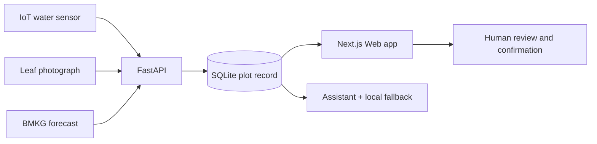
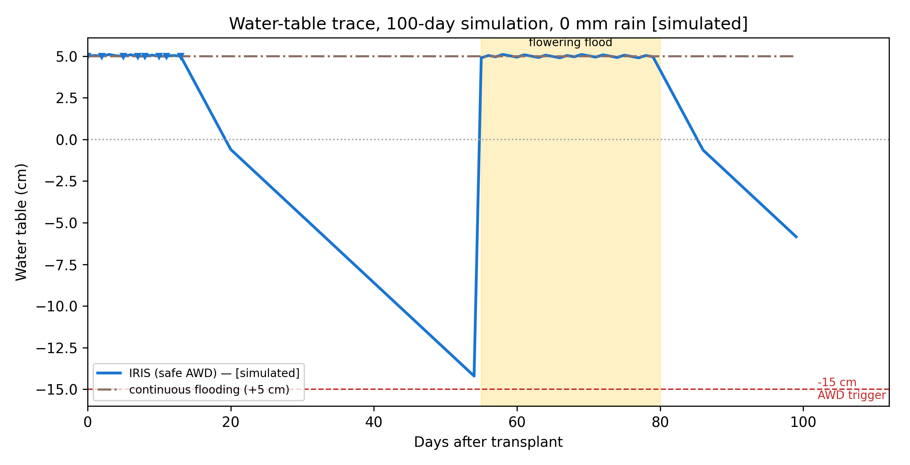
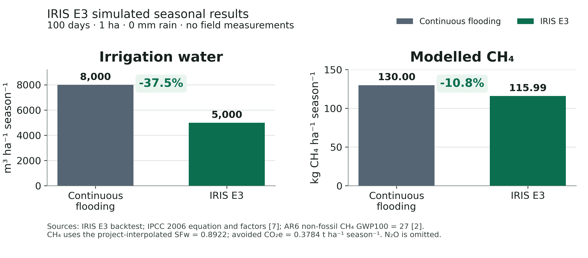

# IRIS — Intelligent Rice Integrated System

Rain-aware AWD, canopy-anomaly triage, and a plot assistant - on one plot

IRIS is designed to connect IoT-assisted water sensing, safe-AWD guidance,
rice-leaf screening, and plot-specific explanations in one farmer-controlled
workflow. The current prototype uses demo data; IRIS recommends, and the
farmer or extension officer decides. IRIS does **not** actuate a pump,
diagnose disease, prescribe pesticide doses, or replace local agronomic
advice.

The project is developed by Joshua Christopher Gunawan, Archangela Sheilla
Haryanto Sundjaya, and Dominic Xaviera in the Department of Informatics,
Universitas Kristen Maranatha.

> **Research-prototype status.** The Web application and deterministic demo
> are working. The water and methane results below are simulations, the leaf
> score is a public-dataset benchmark, and Indonesian field validation remains
> pending. Do not deploy this repository as an unattended farm-control or
> production health-advice service.

## Evidence at a glance

| Component | What exists now | What is not yet established |
| --- | --- | --- |
| Web application | Working FastAPI + Next.js prototype and deterministic 30-day demo | Production authentication, multi-farm tenancy, and operational usability |
| IoT water pathway | Sensor-ingest API, level conversion, stage rules, BMKG context, and human confirmation records | Field node calibration, reliability, and farmer trials |
| Water and CH₄ evidence | Reproducible 100-day, 1 ha, zero-rain E3 simulation | Measured water use, yield, CH₄, or N₂O |
| Leaf screening | Five-class MobileNetV3-Large ONNX model; held-out public-dataset accuracy 0.9784 and macro-F1 0.9783 (`n = 1,621`) | Independent Indonesian field-leaf validation and laboratory diagnosis |
| Rain second opinion | Exploratory logistic regression for a review flag | Held-out predictive validity; it never controls irrigation |

These labels are deliberate: **working prototype**, **simulated**,
**modelled**, **public-dataset benchmark**, and **field validation pending**.

## Problem

**The National Water Challenge**

Indonesia harvested 10.05 million hectares of paddy and produced 53.14
million tonnes of dry unhusked paddy in 2024 [1], making rice water
management a national sustainability concern.

**The Evidence-Based Opportunity**

IRRI's safe AWD protocol lets the field water table fall to −15 cm before
refilling to about +5 cm and protects the flowering flood [3]; field
evidence shows that AWD can reduce irrigation and CH₄ while maintaining
yield, although N₂O may rise [4], [5], [6].

**Research Objective**

Farmers still read field tubes and inspect leaves as separate tasks; IRIS
tests whether one WebApp can unite those observations, recommendations, and
human review on the same plot.

## Approach and methods

IRIS is designed to connect IoT-assisted water sensing, safe-AWD guidance,
rice-leaf screening, and plot-specific explanations in one farmer-controlled
workflow. The current prototype uses demo data; IRIS recommends, and the
farmer or extension officer decides.

### Farmer journey

1. **SENSE + OBSERVE.** An IoT field sensor sends the water level to IRIS;
   the farmer confirms crop stage and adds a leaf photo when needed.
2. **ADD CONTEXT.** IRIS retrieves the official BMKG 72-hour forecast and
   applies its ≥15 mm project rain-hold rule; BMKG alone enters the scheduler
   [12].
3. **ANALYSE.** Stage rules protect establishment and flowering and apply
   safe AWD during vegetative and grain-fill stages; MobileNetV3-Large
   screens five leaf classes [3], [9].
4. **COMBINE + EXPLAIN.** Rules combine water, weather, and leaf signals;
   the assistant explains the same plot record and uses the knowledge base as
   fallback.
5. **REVIEW.** The farmer or extension officer checks the recommendation and
   uncertainty flags.
6. **ACT.** The farmer decides and acts; IRIS never controls a pump or
   prescribes pesticide doses.

### Evaluation

- **DEFINED WATER + CH₄ SCENARIO:** A 100-day, 1 ha, zero-rain simulation
  uses 0.8 cm day⁻¹ drawdown and stage-aware refill to +5 cm. CH₄ follows
  IPCC Tier 1 with a declared project SF_w interpolation and GWP100 = 27;
  the run excludes live rain-hold, N₂O, and field measurements
  [2], [6], [7].
- **PUBLIC-DATASET LEAF TEST:** The classifier uses Sethy and Paddy Doctor
  images [10], [11], [13]. The held-out split provides public-dataset
  evidence; its raw manifest is absent, and Indonesian field leaves remain
  untested.
- **SECONDARY RAIN REVIEW:** Logistic regression uses Open-Meteo rain for
  Salatiga (2018–2026; *n* = 3,154) without a held-out test. It only flags
  disagreement or uncertainty for review; BMKG remains the scheduler input
  [12], [14].

**FIELD VALIDATION PENDING:** sensor calibration, water use, yield,
emissions, usability, and Indonesian leaf performance.

## Architecture



| Layer | Implementation | Responsibility |
| --- | --- | --- |
| Web | Next.js, React, TypeScript | Today view, water trace, leaf screening, evidence, records, and assistant |
| API | FastAPI, Pydantic, SQLite | Ingest, validation, safe-AWD rules, weather snapshots, evidence, and confirmations |
| Vision | ONNX Runtime, MobileNetV3-Large | Quality guard and five-class rice-leaf screening |
| Assistant | DeepSeek-compatible chat client + TF-IDF fallback | Explain stored plot context; tools remain bounded and traceable |
| Evidence | Python backtest and checked JSON outputs | Reproduce the E3 scenario behind the poster figures |

The optional live assistant uses DeepSeek's OpenAI-compatible API and its
experimental `deepseek-v4-flash-vision-exp` model. Without an API key, IRIS
uses local retrieval and labels the response as offline.

## Results

**Headline:** −37.5% irrigation water (8,000 → 5,000 m³ ha⁻¹ season⁻¹).
Modelled CH₄ −10.8%, or 0.3784 t CO₂e ha⁻¹ season⁻¹. Project simulation,
100 days, 1 ha, 0 mm rain.

The defined E3 scenario runs for 100 days on 1 ha with 0 mm rain and
0.8 cm day⁻¹ drawdown. Drawdown is halved below 0 cm. The backtest uses crop
stage triggers and refill to +5 cm; it does not apply the live rain-hold
rule.

| Metric                                  | Continuous flooding | This run (sim.) |
| --------------------------------------- | ------------------- | --------------- |
| Irrigation water (m³ ha⁻¹ season⁻¹)     | 8,000               | 5,000           |
| Flooded days                            | 100                 | 51              |
| Modelled CH₄ (kg ha⁻¹ season⁻¹)         | 130.00              | 115.99          |
| Modelled CO₂e avoided (t ha⁻¹ season⁻¹) | -                   | 0.3784          |
| Model irrigation events                 | 100\*               | 23\*            |

\*Daily water-balance top-ups at 0.8 cm day⁻¹, not 100 farmer visits. The 23
IRIS events are 14 establishment plus 9 flowering top-ups. The −15 cm trigger
never fired during the vegetative or grain-fill stages. The minimum level was
−14.6 cm immediately before the first flowering top-up; the minimum
end-of-day level was −14.2 cm (Fig. 1).

**Fig. 1.** Water-table trace for the 100-day project simulation (0 mm rain),
including pre-refill and end-of-day states. Triangles mark model top-ups, and
the yellow band marks the flowering flood. The dashed −15 cm line is the
safe-AWD trigger [3]; it did not trigger a vegetative or grain-fill refill.



**Fig. 2.** Seasonal irrigation volume and modelled CH₄. The unrounded CH₄
difference is 14.014 kg ha⁻¹; CO₂e = 14.014 × 27 / 1000 = 0.3784 t ha⁻¹
season⁻¹ [2], [7]. N₂O is omitted.



For the committed public-dataset split, the served model reports held-out
test accuracy of 0.9784 (*n* = 1,621; macro-F1 0.9783). The raw split is
absent from the repository, and Indonesian field leaves have not been
evaluated.

### Methane model and assumptions

The CH₄ scenario uses `1.30 × SF_w × t × A`, assumes `SF_p = SF_o = 1`, and
obtains effective `SF_w = 0.8922` by interpolating continuous flooding `1.00`
and the 2006 aggregate irrigated factor `0.78` from 51 flooded days. IPCC
does not prescribe that interpolation. The 2019 Refinement gives
`SF_w = 0.55` for multiple drainage [8], but this project run does not
substitute that factor. GWP100 is 27, and omitting N₂O makes avoided CO₂e an
upper bound. See [IPCC accounting](docs/IPCC_ACCOUNTING.md).

### Field literature - different studies and conditions; context, not validation of IRIS E3

| Outcome vs continuous flooding | IRIS E3               | Field-literature context                           |
| ------------------------------ | --------------------- | -------------------------------------------------- |
| Irrigation water               | −37.5% `[simulated]`  | Mild AWD −23.4% [5]; Asian adoption up to −38% [4] |
| CH₄                            | −10.8% `[modelled]`   | Overall AWD −51.6% [6]                             |
| Climate scope                  | CH₄ only; N₂O omitted | Combined CH₄+N₂O GWP −46.9%, with N₂O +44.0% [6]   |

Present the literature values only as percentages versus continuous
flooding; do not convert them to IRIS absolute units, and do not present them
as a field validation of this software.

## Leaf-model evidence

The current ONNX model screens bacterial leaf blight, blast, brown spot,
healthy, and tungro. The classifier uses Sethy and Paddy Doctor images
[10], [11], [13]. The held-out split provides public-dataset evidence;
its raw manifest is absent, and Indonesian field leaves remain untested. The
committed model card records the split counts, preprocessing, known earlier
leakage, and domain limitations.

The raw images and exact split manifest are not committed, so the reported
split cannot be independently reconstructed from this repository alone.
Paddy Doctor's public mirror does not state a reuse license; see
[third-party notices](THIRD_PARTY_NOTICES.md) before redistributing derived
weights or assets.

## Prototype

**WORKING PROTOTYPE - DEMO DATA:** The WebApp links irrigation guidance,
leaf screening, and plot-specific explanations on Sawah Demo - Salatiga. Its
30-day walkthrough is synthetic and separate from the 100-day evidence run.
The prototype stores computed outputs and the farmer's confirmation of each
recommendation.

## Implications

On one hectare the simulation saves 3,000 m³ of irrigation water per season
(−37.5%) and reduces modelled CH₄ by 10.8%. The Fig. 2 literature strip
places those project results beside field evidence without treating different
studies, units, or conditions as one experiment. The comparison is
contextual, not a validation. What is available now is working software and a
repeatable calculation; field measurements have not been made.

## Conclusion

IRIS does not replace IRRI's safe-AWD protocol [3]. It puts that protocol,
canopy-anomaly triage, and a plot assistant on the same plot, with a person
in the loop. Its water and CH₄ figures are project simulations; the CH₄
scenario uses the IPCC Tier 1 equation plus a clearly stated project
interpolation [7]. Field sensors, chamber CH₄ measurements, yield
measurements, and Indonesian leaf-image tests have not been carried out.

## Technical notes

Accuracy notes retained from the poster copy; use them to check claims
against the figures above.

- Irrigation follows establishment, vegetative AWD, flowering flood, grain
  fill, and harvest. The ≥15 mm rain-hold threshold is an IRIS project rule,
  not a BMKG recommendation. Rain hold never applies during establishment or
  flowering and never overrides the dry hard floor (trigger minus 10 cm).
- The scheduler leaves shallow ponding to recede naturally. At or above
  +15 cm it advises lowering water toward +5 cm if drainage exists; only
  harvest uses drain-to-dry advice.
- An IoT/sensor ingest API exists, but the team has not field-tested the node
  hardware, calibration, or mesocosm protocol.
- The leaf pathway runs five classes on CPU, rejects some low-confidence
  photographs, and combines outputs through explicit rules rather than an
  end-to-end fusion model. The photo class alone is not the combined anomaly
  signal.
- The assistant reads the same plot record, responds in the user's language,
  and uses the knowledge base when the language-model endpoint fails. It
  never recommends pesticide doses.
- The rain logistic regression predicts whether three-day rainfall reaches
  15 mm. It achieved 0.5891 in-sample accuracy versus a 0.5022 wet base rate,
  has no held-out test, and flags review when it disagrees with BMKG or
  scores 0.35–0.65. It never withholds irrigation.
- The CH₄ scenario uses `1.30 × SF_w × t × A`, assumes `SF_p = SF_o = 1`, and
  obtains effective `SF_w = 0.8922` by interpolating continuous flooding
  `1.00` and the 2006 aggregate irrigated factor `0.78` from 51 flooded days.
  IPCC does not prescribe that interpolation. The 2019 Refinement gives
  `SF_w = 0.55` for multiple drainage [8], but this project run does not
  substitute that factor. GWP100 is 27, and omitting N₂O makes avoided CO₂e
  an upper bound.
- The 30-day demo plot and the 100-day evidence run are separate. The
  emission sheet reports the evidence run, not the demo window or the leaf
  class.

## Run locally

Prerequisites: Python 3.11+, Node.js 22+, and npm.

### Backend

```bash
python -m venv .venv
source .venv/bin/activate  # Windows PowerShell: .venv\Scripts\Activate.ps1
python -m pip install -r apps/api/requirements.txt
cp .env.example .env      # Windows PowerShell: Copy-Item .env.example .env
python -m alembic -c apps/api/alembic.ini upgrade head   # create the SQLite schema
python apps/api/scripts/seed_demo.py
python -m uvicorn app.main:app --app-dir apps/api --host 127.0.0.1 --port 8000
```

### Frontend

```bash
cd apps/web
npm ci
npm run build
npm run start
```

Open <http://localhost:3000>. The seed creates a synthetic 30-day
`Sawah Demo - Salatiga` walkthrough; it is separate from the 100-day E3
evidence run.

`DEEPSEEK_API_KEY` is optional. Keep it empty for the offline assistant, and
never commit `.env`. See [deployment guidance](docs/DEPLOYMENT_GUIDE.md) for
configuration and health checks.

## Evidence reproducibility

The E3 numbers quoted in this README are generated from committed inputs,
not hand-typed:

```bash
python experiments/run_all.py   # reruns the E3 backtest and rewrites the summary
```

`experiments/outputs/backtest_summary.json` holds the machine-readable E3
result served by the API evidence endpoints, and
`experiments/outputs/chart_context_data.csv` preserves the cited
field-literature values behind the comparison table. The two figures above
are the exported chart images printed on the submitted poster
(`assets/poster/chart_water_trace.png`, `assets/poster/chart_results.png`).
See [METHODOLOGY](docs/METHODOLOGY.md) for the scenario assumptions and
[IPCC accounting](docs/IPCC_ACCOUNTING.md) for the methane model.

## Tests

```bash
python -m pytest apps/api/tests

cd apps/web
npm ci
npm run typecheck
npm test
npm run build
```

## Security, privacy, and deployment boundary

The default configuration is a localhost demonstration. It has no farmer-user
authentication, no tenant isolation, and no production rate limiter. An empty
`IRIS_DEVICE_TOKEN` leaves sensor ingest unauthenticated. The assistant stores
submitted chat text, and leaf screening stores a SHA-256 image hash and result
metadata. Do not expose the demo API to the Internet or submit personal,
confidential, or clinical information.

Before any external deployment, disable demo mode, configure a strong device
token, put the application behind authenticated TLS infrastructure, restrict
CORS, define retention/deletion rules, add rate limits, and complete a threat
model. See [SECURITY.md](SECURITY.md).

## Repository map

| Path | Content |
| --- | --- |
| `apps/api/` | FastAPI service, scheduler, vision runtime, assistant, migrations, and tests |
| `apps/web/` | Next.js interface and frontend tests |
| `experiments/` | Backtest, model-training/evaluation code, and outputs |
| `assets/poster/` | The two evidence charts printed on the submitted poster (Fig. 1 and Fig. 2) |
| [docs/ARCHITECTURE.md](docs/ARCHITECTURE.md) | Detailed components and data flow |
| [docs/METHODOLOGY.md](docs/METHODOLOGY.md) | E1-E4 protocols and evidence labels |
| [docs/IPCC_ACCOUNTING.md](docs/IPCC_ACCOUNTING.md) | Tier 1 assumptions and caveats |
| [docs/MODEL_CARD.md](docs/MODEL_CARD.md) | Model provenance, metrics, intended use, and limits |
| [docs/SENSOR_VALIDATION.md](docs/SENSOR_VALIDATION.md) | Pending sensor-validation protocol |

## References

- **[1]** Badan Pusat Statistik. “Pada 2024, luas panen padi mencapai sekitar
  10,05 juta hektare dengan produksi padi sebanyak 53,14 juta ton GKG,” 2025.
  <https://www.bps.go.id/id/pressrelease/2025/02/03/2414/>
- **[2]** Forster, P., et al. “The Earth's energy budget, climate feedbacks,
  and climate sensitivity.” *IPCC AR6 WGI*, Chapter 7 and Supplementary
  Material Table 7.SM.7, 2021. <https://doi.org/10.1017/9781009157896.009>
- **[3]** International Rice Research Institute. “Saving water with
  alternate wetting drying (AWD).” *Rice Knowledge Bank*.
  <https://www.knowledgebank.irri.org/training/fact-sheets/water-management/saving-water-alternate-wetting-drying-awd>
- **[4]** Lampayan, R. M., Rejesus, R. M., Singleton, G. R., and Bouman,
  B. A. M. “Adoption and economics of alternate wetting and drying water
  management for irrigated lowland rice.” *Field Crops Research* 170 (2015):
  95-108. <https://doi.org/10.1016/j.fcr.2014.10.013>
- **[5]** Carrijo, D. R., Lundy, M. E., and Linquist, B. A. “Rice yields and
  water use under alternate wetting and drying irrigation: A meta-analysis.”
  *Field Crops Research* 203 (2017): 173-180.
  <https://doi.org/10.1016/j.fcr.2016.12.002>
- **[6]** Zhao, C., Qiu, R., Zhang, T., Luo, Y., and Agathokleous, E.
  “Effects of alternate wetting and drying irrigation on methane and nitrous
  oxide emissions from rice fields: A meta-analysis.” *Global Change Biology*
  30, no. 12 (2024): e17581. <https://doi.org/10.1111/gcb.17581>
- **[7]** IPCC. *2006 IPCC Guidelines for National Greenhouse Gas
  Inventories*, Vol. 4, Ch. 5, Eqs. 5.1-5.2 and Tables 5.11-5.12.
  <https://www.ipcc-nggip.iges.or.jp/public/2006gl/pdf/4_Volume4/V4_05_Ch5_Cropland.pdf>
- **[8]** IPCC. *2019 Refinement to the 2006 IPCC Guidelines*, Vol. 4,
  Ch. 5, Table 5.12.
  <https://www.ipcc-nggip.iges.or.jp/public/2019rf/pdf/4_Volume4/19R_V4_Ch05_Cropland.pdf>
- **[9]** Howard, A., et al. “Searching for MobileNetV3.” *ICCV* (2019):
  1314-1324. <https://doi.org/10.1109/ICCV.2019.00140>
- **[10]** Sethy, P. K., Barpanda, N. K., Rath, A. K., and Behera, S. K.
  “Deep feature based rice leaf disease identification using support vector
  machine.” *Computers and Electronics in Agriculture* 175 (2020): 105527.
  <https://doi.org/10.1016/j.compag.2020.105527>
- **[11]** Sethy, P. K. “Rice Leaf Disease Image Samples.” Mendeley Data,
  Version 1, 2020. <https://doi.org/10.17632/fwcj7stb8r.1>
- **[12]** Badan Meteorologi, Klimatologi, dan Geofisika. “Data Prakiraan
  Cuaca Terbuka.” <https://data.bmkg.go.id/prakiraan-cuaca/>
- **[13]** Petchiammal, A., Briskline Kiruba, S., Murugan, D., and
  Pandarasamy, A. “Paddy Doctor: A Visual Image Dataset for Automated Paddy
  Disease Classification and Benchmarking.” *CODS-COMAD* (2023): 203-207.
  <https://doi.org/10.1145/3570991.3570994>
- **[14]** Open-Meteo. “Historical Weather API.”
  <https://open-meteo.com/en/docs/historical-weather-api>;
  software record <https://doi.org/10.5281/zenodo.7970649>.

## Reuse status

This repository currently has **no project license**. Public visibility does
not grant permission to copy, modify, or redistribute the project code or
model. The repository owner must choose a license before third-party reuse can
be encouraged. Third-party datasets and media keep their own terms; see
[THIRD_PARTY_NOTICES.md](THIRD_PARTY_NOTICES.md).
