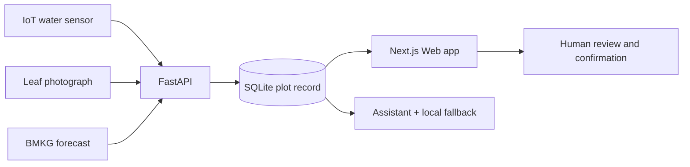

# IRIS — Intelligent Rice Integrated System

IRIS is a farmer-centred research prototype that brings water-level sensing,
rain-aware safe alternate wetting and drying (AWD), rice-leaf image screening,
and plot-specific explanations into one Web application. It recommends; the
farmer or extension officer reviews and decides. IRIS does **not** actuate a
pump, diagnose disease, prescribe pesticide doses, or replace local agronomic
advice.

The project is developed by Joshua Christopher Gunawan, Archangela Sheilla
Haryanto Sundjaya, and Dominic Xaviera in the Department of Informatics,
Universitas Kristen Maranatha.

> **Research-prototype status.** The Web application and deterministic demo
> are working. The water and methane results below are simulations, the leaf
> score is a public-dataset benchmark, and Indonesian field validation remains
> pending. Do not deploy this repository as an unattended farm-control or
> production health-advice service.

## Evidence at a glance

| Component | What exists now | What is not yet established |
| --- | --- | --- |
| Web application | Working FastAPI + Next.js prototype and deterministic 30-day demo | Production authentication, multi-farm tenancy, and operational usability |
| IoT water pathway | Sensor-ingest API, level conversion, stage rules, BMKG context, and human confirmation records | Field node calibration, reliability, and farmer trials |
| Water and CH4 evidence | Reproducible 100-day, 1 ha, zero-rain E3 simulation | Measured water use, yield, CH4, or N2O |
| Leaf screening | Five-class MobileNetV3-Large ONNX model; held-out public-dataset accuracy 0.9784 and macro-F1 0.9783 (`n = 1,621`) | Independent Indonesian field-leaf validation and laboratory diagnosis |
| Rain second opinion | Exploratory logistic regression for a review flag | Held-out predictive validity; it never controls irrigation |

These labels are deliberate: **working prototype**, **simulated**,
**modelled**, **public-dataset benchmark**, and **field validation pending**.

## How IRIS works

1. **Sense and observe.** An IoT field sensor can send water level to IRIS;
   the farmer confirms plot context and adds a leaf photograph when needed.
2. **Add weather context.** IRIS retrieves BMKG's official 72-hour forecast.
   A forecast total of at least 15 mm activates an IRIS project rain-hold rule;
   the threshold is not a BMKG recommendation [R12].
3. **Analyse safely.** Stage rules protect establishment and flowering and
   apply safe AWD during vegetative and grain-fill stages [R3]. A
   MobileNetV3-Large model screens five leaf classes [R9].
4. **Combine and explain.** Explicit rules combine water, weather, and leaf
   signals. The assistant explains the same stored plot record and falls back
   to the local knowledge base when the configured language-model service is
   unavailable.
5. **Review uncertainty.** The interface exposes stale data, low-confidence
   images, weather disagreement, evidence labels, and the reason behind each
   recommendation.
6. **Decide and act.** A farmer or extension officer accepts, defers, declines,
   or corrects the recommendation. IRIS records that response but does not
   operate field hardware.

### Decision safeguards

- BMKG is the scheduler's weather source. The exploratory rain logistic
  regression is only a second-opinion review flag and never withholds water.
- Rain hold does not override the dry hard floor and does not apply during
  establishment or flowering.
- Shallow ponding recedes naturally. At excessive ponding (at least +15 cm),
  IRIS advises lowering toward +5 cm only when drainage is available; harvest
  is the only drain-to-dry stage.
- Leaf output is image triage, not a causal or laboratory diagnosis. The
  application gives no pesticide product or dose.
- The combined concern level comes from an inspectable rule table, not an
  unreported end-to-end fusion model.

## Architecture



| Layer | Implementation | Responsibility |
| --- | --- | --- |
| Web | Next.js, React, TypeScript | Today view, water trace, leaf screening, evidence, records, and assistant |
| API | FastAPI, Pydantic, SQLite | Ingest, validation, safe-AWD rules, weather snapshots, evidence, and confirmations |
| Vision | ONNX Runtime, MobileNetV3-Large | Quality guard and five-class rice-leaf screening |
| Assistant | DeepSeek-compatible chat client + TF-IDF fallback | Explain stored plot context; tools remain bounded and traceable |
| Evidence | Python backtest and checked JSON outputs | Reproduce the E3 scenario and its poster figures |

The optional live assistant uses DeepSeek's OpenAI-compatible API and its
experimental `deepseek-v4-flash-vision-exp` model. Without an API key, IRIS
uses local retrieval and labels the response as offline.

## E3 simulation results

The defined E3 scenario runs for 100 days on 1 ha with 0 mm rain and
0.8 cm day^-1 drawdown. Drawdown is halved below 0 cm. The backtest uses crop
stage triggers and refill to +5 cm; it does not apply the live rain-hold rule.

| Metric | Continuous flooding | IRIS E3 | Difference |
| --- | ---: | ---: | ---: |
| Irrigation water | 8,000 m3 ha^-1 season^-1 | 5,000 m3 ha^-1 season^-1 | -37.5% |
| Flooded days | 100 | 51 | -49 days |
| Modelled CH4 | 130.00 kg ha^-1 season^-1 | 115.99 kg ha^-1 season^-1 | -10.8% |
| Modelled CO2e avoided | — | 0.3784 t ha^-1 season^-1 | CH4 only |


The methane calculation follows the IPCC 2006 Tier 1 structure
`1.30 x SF_w x t x A` with `SF_p = SF_o = 1` [R7]. IRIS obtains
`SF_w = 0.8922` by linearly interpolating the 2006 continuous-flooding factor
1.00 and aggregate multiple-aeration factor 0.78 using the simulated flooded-day
fraction. **That interpolation is a project assumption, not an IPCC equation.**
The 2019 Refinement gives `SF_w = 0.55` for multiple drainage [R8], but E3 does
not substitute that factor. CO2e uses non-fossil CH4 GWP100 = 27 [R2]. Because
N2O is omitted, avoided CO2e is an upper bound on net climate benefit where AWD
raises N2O [R6]. See [IPCC accounting](docs/IPCC_ACCOUNTING.md).

Field literature provides context, not validation of E3:

| Outcome vs continuous flooding | IRIS E3 | Field-literature context |
| --- | --- | --- |
| Irrigation water | -37.5% `[simulated]` | Mild AWD -23.4% [R5]; Asian adoption up to -38% [R4] |
| CH4 | -10.8% `[modelled]` | Overall AWD -51.6% [R6] |
| Climate scope | CH4 only; N2O omitted | Combined CH4+N2O GWP -46.9%, with N2O +44.0% [R6] |

Do not convert the literature percentages into IRIS absolute units or present
them as a field validation of this software.

## Leaf-model evidence

The current ONNX model screens bacterial leaf blight, blast, brown spot,
healthy, and tungro. It was trained from Sethy's CC BY 4.0 rice-leaf dataset
[R10, R11] and selected classes from the publicly accessible Paddy Doctor
dataset [R13]. The reported held-out score is accuracy 0.9784 and macro-F1
0.9783 on 1,621 images. The committed model card records the split counts,
preprocessing, known earlier leakage, and domain limitations.

The raw images and exact split manifest are not committed, so the reported
split cannot be independently reconstructed from this repository alone.
Paddy Doctor's public mirror does not state a reuse license; see
[third-party notices](THIRD_PARTY_NOTICES.md) before redistributing derived
weights or assets. Indonesian field leaves have not been evaluated.

## Run locally

Prerequisites: Python 3.11+, Node.js 22+, and npm.

### Backend

```bash
python -m venv .venv
source .venv/bin/activate  # Windows PowerShell: .venv\Scripts\Activate.ps1
python -m pip install -r apps/api/requirements.txt
cp .env.example .env      # Windows PowerShell: Copy-Item .env.example .env
python -m alembic -c apps/api/alembic.ini upgrade head   # create the SQLite schema
python apps/api/scripts/seed_demo.py
python -m uvicorn app.main:app --app-dir apps/api --host 127.0.0.1 --port 8000
```

### Frontend

```bash
cd apps/web
npm ci
npm run build
npm run start
```

Open <http://localhost:3000>. The seed creates a synthetic 30-day
`Sawah Demo - Salatiga` walkthrough; it is separate from the 100-day E3
evidence run.

`DEEPSEEK_API_KEY` is optional. Keep it empty for the offline assistant, and
never commit `.env`. See [deployment guidance](docs/DEPLOYMENT_GUIDE.md) for
configuration and health checks.

## Reproduce the evidence charts

The E3 numbers in this README and the two poster charts are generated from
committed inputs, not hand-typed:

```bash
python -m pip install -r experiments/requirements.txt
python experiments/run_all.py                 # reruns the E3 backtest
python experiments/generate_poster_charts.py  # writes assets/poster/*.svg + *.png
python experiments/generate_poster_charts.py --check   # fails if outputs drift
```

`experiments/outputs/backtest_summary.json` holds the machine-readable E3
result and `experiments/outputs/chart_context_data.csv` the cited
field-literature context. See [METHODOLOGY](docs/METHODOLOGY.md) for the
scenario assumptions and [IPCC accounting](docs/IPCC_ACCOUNTING.md) for the
methane model.

## Tests

```bash
python -m pytest apps/api/tests

cd apps/web
npm ci
npm run typecheck
npm test
npm run build
```

## Security, privacy, and deployment boundary

The default configuration is a localhost demonstration. It has no farmer-user
authentication, no tenant isolation, and no production rate limiter. An empty
`IRIS_DEVICE_TOKEN` leaves sensor ingest unauthenticated. The assistant stores
submitted chat text, and leaf screening stores a SHA-256 image hash and result
metadata. Do not expose the demo API to the Internet or submit personal,
confidential, or clinical information.

Before any external deployment, disable demo mode, configure a strong device
token, put the application behind authenticated TLS infrastructure, restrict
CORS, define retention/deletion rules, add rate limits, and complete a threat
model. See [SECURITY.md](SECURITY.md).

## Repository map

| Path | Content |
| --- | --- |
| `apps/api/` | FastAPI service, scheduler, vision runtime, assistant, migrations, and tests |
| `apps/web/` | Next.js interface and frontend tests |
| `experiments/` | Backtest, model-training/evaluation code, and outputs |
| `assets/poster/` | Public evidence charts, not the submitted poster package |
| [docs/ARCHITECTURE.md](docs/ARCHITECTURE.md) | Detailed components and data flow |
| [docs/METHODOLOGY.md](docs/METHODOLOGY.md) | E1-E4 protocols and evidence labels |
| [docs/IPCC_ACCOUNTING.md](docs/IPCC_ACCOUNTING.md) | Tier 1 assumptions and caveats |
| [docs/MODEL_CARD.md](docs/MODEL_CARD.md) | Model provenance, metrics, intended use, and limits |
| [docs/SENSOR_VALIDATION.md](docs/SENSOR_VALIDATION.md) | Pending sensor-validation protocol |

## References

- **[R1]** Badan Pusat Statistik. “Pada 2024, luas panen padi mencapai sekitar
  10,05 juta hektare dengan produksi padi sebanyak 53,14 juta ton GKG,” 2025.
  <https://www.bps.go.id/id/pressrelease/2025/02/03/2414/>
- **[R2]** Forster, P., et al. “The Earth's energy budget, climate feedbacks,
  and climate sensitivity.” *IPCC AR6 WGI*, Chapter 7 and Supplementary
  Material Table 7.SM.7, 2021. <https://doi.org/10.1017/9781009157896.009>
- **[R3]** International Rice Research Institute. “Saving water with
  alternate wetting drying (AWD).” *Rice Knowledge Bank*.
  <https://www.knowledgebank.irri.org/training/fact-sheets/water-management/saving-water-alternate-wetting-drying-awd>
- **[R4]** Lampayan, R. M., Rejesus, R. M., Singleton, G. R., and Bouman,
  B. A. M. “Adoption and economics of alternate wetting and drying water
  management for irrigated lowland rice.” *Field Crops Research* 170 (2015):
  95-108. <https://doi.org/10.1016/j.fcr.2014.10.013>
- **[R5]** Carrijo, D. R., Lundy, M. E., and Linquist, B. A. “Rice yields and
  water use under alternate wetting and drying irrigation: A meta-analysis.”
  *Field Crops Research* 203 (2017): 173-180.
  <https://doi.org/10.1016/j.fcr.2016.12.002>
- **[R6]** Zhao, C., Qiu, R., Zhang, T., Luo, Y., and Agathokleous, E.
  “Effects of alternate wetting and drying irrigation on methane and nitrous
  oxide emissions from rice fields: A meta-analysis.” *Global Change Biology*
  30, no. 12 (2024): e17581. <https://doi.org/10.1111/gcb.17581>
- **[R7]** IPCC. *2006 IPCC Guidelines for National Greenhouse Gas
  Inventories*, Vol. 4, Ch. 5, Eqs. 5.1-5.2 and Tables 5.11-5.12.
  <https://www.ipcc-nggip.iges.or.jp/public/2006gl/pdf/4_Volume4/V4_05_Ch5_Cropland.pdf>
- **[R8]** IPCC. *2019 Refinement to the 2006 IPCC Guidelines*, Vol. 4,
  Ch. 5, Table 5.12.
  <https://www.ipcc-nggip.iges.or.jp/public/2019rf/pdf/4_Volume4/19R_V4_Ch05_Cropland.pdf>
- **[R9]** Howard, A., et al. “Searching for MobileNetV3.” *ICCV* (2019):
  1314-1324. <https://doi.org/10.1109/ICCV.2019.00140>
- **[R10]** Sethy, P. K., Barpanda, N. K., Rath, A. K., and Behera, S. K.
  “Deep feature based rice leaf disease identification using support vector
  machine.” *Computers and Electronics in Agriculture* 175 (2020): 105527.
  <https://doi.org/10.1016/j.compag.2020.105527>
- **[R11]** Sethy, P. K. “Rice Leaf Disease Image Samples.” Mendeley Data,
  Version 1, 2020. <https://doi.org/10.17632/fwcj7stb8r.1>
- **[R12]** Badan Meteorologi, Klimatologi, dan Geofisika. “Data Prakiraan
  Cuaca Terbuka.” <https://data.bmkg.go.id/prakiraan-cuaca/>
- **[R13]** Petchiammal, A., Briskline Kiruba, S., Murugan, D., and
  Pandarasamy, A. “Paddy Doctor: A Visual Image Dataset for Automated Paddy
  Disease Classification and Benchmarking.” *CODS-COMAD* (2023): 203-207.
  <https://doi.org/10.1145/3570991.3570994>
- **[R14]** Open-Meteo. “Historical Weather API.”
  <https://open-meteo.com/en/docs/historical-weather-api>;
  software record <https://doi.org/10.5281/zenodo.7970649>.

## Reuse status

This repository currently has **no project license**. Public visibility does
not grant permission to copy, modify, or redistribute the project code or
model. The repository owner must choose a license before third-party reuse can
be encouraged. Third-party datasets and media keep their own terms; see
[THIRD_PARTY_NOTICES.md](THIRD_PARTY_NOTICES.md).
