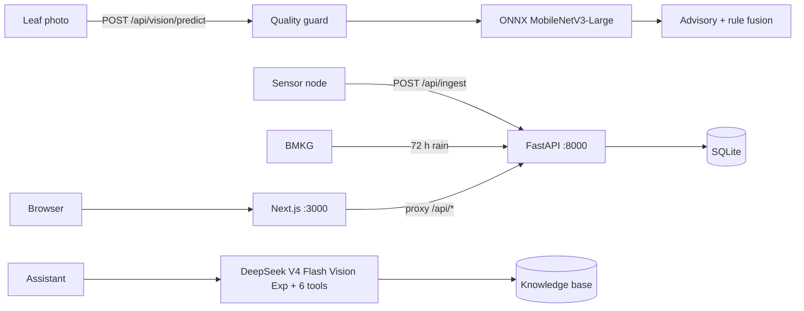

# IRIS: Intelligent Rice Integrated System

Canonical repository for the INOVATALK 2026 entry (Department of Informatics,
Universitas Kristen Maranatha). Poster claims, the jury demo, and the A1 PDF
are taken from this tree. `C:\xampp\htdocs\inovatalk` is an archived Telegram
and Streamlit MVP; it is not a source of numbers.

IRIS is a single-plot decision record. A water-level reading, a leaf
photograph, and the assistant all refer to the same plot. Irrigation follows
IRRI safe AWD (Alternate Wetting and Drying) with a 72-hour rain skip.
Leaf photographs are classified on-device with MobileNetV3-Large (ONNX).
Combined risk is a documented rule table (disease class x AWD state x wet
weather), not a trained fusion model. Season water and CH4 figures on the
receipt are the E3 backtest, labelled [simulated].

## Architecture



## Modules

1. **Water.** Ingest `dist_cm`, map to water table, run the stage machine and
   rain-aware scheduler, store the decision, expose the E3 season receipt
   (IPCC 2006 Tier-1 CH4, AR6 GWP100 = 27).
2. **Leaf.** Quality guard, then four-class ONNX triage (blast, brown spot,
   tungro, bacterial leaf blight). Screening, not a laboratory diagnosis.
3. **Assistant.** DeepSeek Chat Completions (`https://api.deepseek.com`),
   default model `deepseek-v4-flash-vision-exp` (experimental vision ID
   published 21 August 2026). Up to six tool hops. Attached photographs are
   sent as `image_url` parts; the official class still comes from
   `run_vision_triage` (ONNX). Without `DEEPSEEK_API_KEY`, replies use TF-IDF
   retrieval and are marked offline.

## Quickstart

Backend (Windows PowerShell), from `apps\api`:

```powershell
..\..\.venv\Scripts\python.exe -m pip install -r requirements.txt
..\..\.venv\Scripts\python.exe scripts\seed_demo.py
..\..\.venv\Scripts\python.exe -m uvicorn app.main:app --port 8000
```

Copy `.env.example` to `.env` and set `DEEPSEEK_API_KEY` for live assistant
replies. Do not commit `.env`.

Frontend, from `apps\web`:

```powershell
npm install
npm run build
npm run start
```

Open http://localhost:3000

## Environment

| Variable | Default | Notes |
| --- | --- | --- |
| `DEEPSEEK_API_KEY` | empty | Empty: assistant stays in offline retrieval |
| `IRIS_LLM_MODEL` | `deepseek-v4-flash-vision-exp` | Official DeepSeek vision-exp ID |
| `IRIS_DB` | `sqlite:///<repo>/apps/api/storage/iris.db` | SQLite URL |
| `IRIS_DEVICE_TOKEN` | empty | Empty: ingest auth is optional (demo) |
| `WEB_ORIGIN` | `http://localhost:3000` | CORS origin |
| `BMKG_ADM4` | `33.73.01.1003` | Fallback kelurahan if a plot has no `bmkg_adm4`. Catalog is `bmkg_areas` |
| `BMKG_API_KEY` | empty | Optional; publik forecast does not require a key |

## Experiment E3 (simulated, 100 days, 1 ha, 0 mm rain)

From `experiments/run_all.py` / `experiments/outputs/backtest_summary.json`:

| Metric | Continuous flood | Safe AWD | Difference |
| --- | --- | --- | --- |
| Daily irrigation events (model artefact) | 100 | 23 | not 23 dry-down cycles to -15 cm |
| Water volume | 8,000 m3/ha | 5,000 m3/ha | -37.5% |
| CH4 | 130.00 kg/ha | 115.99 kg/ha | 0.378 t CO2e (GWP 27) |
| Effective SF_w | n/a | 0.8922 | interpolated, stated in IPCC_ACCOUNTING.md |

CO2e uses the unrounded CH4 difference (14.014 kg). Demo rows are badged
**DEMO**. Leaf output is triage. The ONNX pack is trained on a public Mendeley
set; field validation is not claimed ([docs/MODEL_CARD.md](docs/MODEL_CARD.md)).

## Documents

| File | Content |
| --- | --- |
| [docs/ARCHITECTURE.md](docs/ARCHITECTURE.md) | Components and data flow |
| [docs/METHODOLOGY.md](docs/METHODOLOGY.md) | AWD protocol and experiments |
| [docs/IPCC_ACCOUNTING.md](docs/IPCC_ACCOUNTING.md) | Tier-1 CH4 accounting |
| [docs/SENSOR_VALIDATION.md](docs/SENSOR_VALIDATION.md) | Sensor notes |
| [docs/DEPLOYMENT_GUIDE.md](docs/DEPLOYMENT_GUIDE.md) | Run and deploy |
| [docs/poster-content.md](docs/poster-content.md) | Poster copy |
| [docs/MODEL_CARD.md](docs/MODEL_CARD.md) | Vision model card |
| [experiments/DEFINISI_METRIK.md](experiments/DEFINISI_METRIK.md) | Metric definitions |

```
iris-platform/
├── apps/api/       FastAPI
├── apps/web/       Next.js
├── docs/
├── experiments/
└── assets/poster/
```
